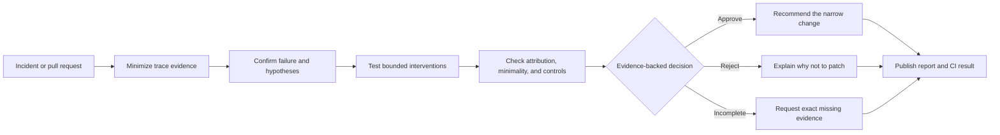

# Causure

**Evidence-gated change control for AI agents.**

> Change only what the evidence supports.

Causure helps teams decide whether an AI-agent incident actually justifies changing a
prompt, tool description, model route, retrieval policy, reviewer, retry rule, or other
harness component.

Instead of treating the first plausible patch as the answer, Causure checks reproduction,
causal attribution, minimality, controls, cost, and latency. It produces an explicit
decision and a reviewable evidence trail; it does not generate, merge, deploy, or roll back
changes by itself.

## Why Causure

An agent can fail because its prompt is wrong. It can also fail because a tool contract
changed, retrieval returned stale evidence, a dependency timed out, or the proposed fix
targets the wrong component. A patch that improves one example can still be the wrong
production change.

Causure makes those distinctions visible:

| Evidence state | Typical decision |
|---|---|
| The failure reproduces, an isolated intervention fixes it, and controls pass | `approve` |
| The proposal targets the wrong component, is unnecessarily broad, or fails a control | `reject` |
| Required evidence is missing or inconclusive | `needs_evidence` |
| Policy requires a person to resolve the remaining risk | `human_review` |
| Evidence supports a narrowly qualified exception | `conditional_pass` |

## Try it

Causure requires Python 3.11 or newer. The current alpha is distributed as a GitHub release
asset rather than through PyPI.

```powershell
python -m pip install "https://github.com/MusaShams/Causure/releases/download/v0.4.0a18/causure-0.4.0a18-py3-none-any.whl"
causure demo
```

The offline demo creates two synthetic investigations:

```text
PATCH: APPROVE - Justified minimal patch
  The failure reproduced, the isolated tool-description fix worked, and controls passed.

DO_NOT_PATCH: REJECT - Attractive but overbroad change
  The proposal changed the global prompt, targeted the wrong surface, and failed a control.
```

Open the generated `causure-demo/README.md` to inspect both human-readable reports and the
canonical machine result. The demo uses no credentials, network access, Docker, or service
deployment.

To work from source instead:

```powershell
git clone https://github.com/MusaShams/Causure.git
Set-Location Causure
python -m pip install -e .
causure demo
```

## Start from an agent trace

The guided path takes an OTLP/OpenInference JSON export to a bounded investigation without
requiring you to hand-author Causure JSON:

```powershell
causure init my-agent-project
Set-Location my-agent-project
causure investigate <path-to-agent-traces.json>
causure case create <investigation-path-printed-by-causure>
```

`investigate` previews redaction and candidate clusters before writing anything. `case
create` verifies the selected evidence and asks for the incident, expected behavior,
hypotheses, proposed change, no-change alternative, and controls in plain language. Missing
evidence remains a visible `needs_evidence` decision rather than being invented.

See [Getting started](docs/getting-started.md) for a complete walkthrough.

## How it works



Causure separates four concerns:

1. **Collect:** import minimized trace references while keeping raw messages and secrets out
   of the stored investigation.
2. **Investigate:** record the observed failure, expected behavior, competing hypotheses,
   and the possibility that no harness change is needed.
3. **Evaluate:** run company-owned replay and evaluator adapters within explicit time, case,
   outcome, concurrency, and cost budgets.
4. **Decide:** verify causal relevance, minimality, positive and negative controls,
   regressions, cost, and latency before publishing a result.

## GitHub pull-request review

Causure can map changed paths to a configured harness component, load trusted case-generation
logic from the protected base revision, treat candidate code as data, and publish a stable
Check Run bound to the exact pull-request head.

Configure a component with the CLI:

```powershell
causure github-configure `
  --component-id refund-tool-description `
  --component tool_description `
  --path "agent/tools/**/*.py" `
  --case evidence/refund-tool-description.case.json
```

The [GitHub Action guide](docs/github-action.md) contains the full-SHA-pinned workflow and
permission model. Fork pull requests do not receive protected credentials or execute
trusted adapters from candidate code.

## What is included

| Area | Available today |
|---|---|
| Local workflow | `init`, `doctor`, `demo`, guided trace investigation, and guided case creation |
| Evidence gate | Reproduction, attribution, no-change, minimality, controls, regression, cost, and latency checks |
| CI review | GitHub Check Runs and Azure DevOps/TFVC build evidence bound to exact revisions |
| Execution boundaries | Process budgets, digest-pinned container execution, and a provider hard-quota reference |
| Governance | Signed approvals, policy exceptions, tenant roles, and tamper-evident audit exports |
| Team reference | Transactional single-host store, API boundary, investigation queue, evidence console, and change-case dashboard |
| Post-deployment | Evidence-bound canary comparison with explicit inconclusive outcomes |

These deeper integrations are reference implementations for evaluation and controlled
pilots. They are not a hosted enterprise control plane.

## Verified public alpha

The current release is
[`v0.4.0a18`](https://github.com/MusaShams/Causure/releases/tag/v0.4.0a18).

| Qualification | Result |
|---|---|
| Deterministic test suite | 556 passed; 1 expected platform-specific skip |
| Lint and formatting | Passed |
| Fresh offline wheel installs | Python 3.11, 3.12, and 3.13 passed |
| Artifact reproducibility | Wheel reproduced byte-for-byte; normalized sdist rebuilt the exact wheel |
| Unfamiliar-user demo | Completed in under five minutes without assistance; both outcomes explained correctly |
| Hosted decision stories | Approve, reject, needs-evidence, and credential-free fork boundaries exercised |
| Anonymous release audit | Repository, one-root history, tag, and all seven downloaded asset hashes verified |
| Release security audit | Zero open CodeQL, secret-scanning, or Dependabot alerts at qualification time |

The release includes the wheel, normalized source archive, SPDX SBOM, architecture image,
portfolio demonstration, machine-readable evidence matrix, and SHA-256 manifest. The
[public-release qualification](docs/qualifications/causure-public-release-2026-08-13.json)
records the exact claims and limitations.

## Production boundary

Causure is a functional alpha, not a supported multi-tenant production control plane.

- Company replay, evaluator, and case-generator quality remains a trusted input.
- The Team reference uses single-host SQLite and local storage.
- Shared relational authority, immutable object retention, disaster recovery, multi-host
  coordination, production TLS and secret management, generalized SSO, and an independent
  security review remain future work.
- Causure recommends decisions but never merges, deploys, promotes, or rolls back changes.

See the [threat model](docs/threat-model.md) and [security policy](SECURITY.md) before using
Causure with company evidence or infrastructure.

## Documentation

- [Documentation map](docs/index.md)
- [Getting started](docs/getting-started.md)
- [Engineering case study](docs/portfolio-case-study.md)
- [Architecture](docs/architecture.md)
- [GitHub Action](docs/github-action.md)
- [Trace collection and redaction](docs/trace-collection.md)
- [Trusted adapters and case generation](docs/trusted-case-generation.md)
- [Evidence bundles](docs/evidence-bundle.md)
- [Deployment guide](docs/deployment-guide.md)
- [Productization roadmap](docs/productization-roadmap.md)

Run `causure --help-all` for the complete automation and integration command catalog.

## Development

```powershell
python -m pip install -e ".[dev]"
python -m unittest discover -s tests -v
python -m ruff check .
python -m ruff format --check .
```

See [Contributing](CONTRIBUTING.md) for development and validation expectations.

## License

Causure is available under the [Apache License 2.0](LICENSE).
