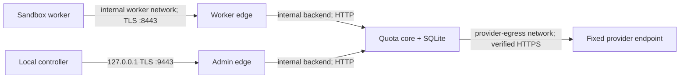

# Split-edge OpenAI-compatible quota pilot

Causure `0.4.0a18` packages the narrow OpenAI-compatible quota reference as a
runnable, split-edge Docker pilot. It is suitable for a controlled company integration
exercise on one trusted Docker host. It is not production hard-spend qualification, and
the rebranded images require a fresh local qualification before use. The retained
pre-rebrand qualification made no provider API request and is historical evidence only.

The pilot preserves the central credential boundary: a sandbox worker receives only a
short-lived lease token. The real provider key exists in protected pilot state and is
mounted only into the quota core.



The worker edge exposes only `/healthz`, `/readyz`, and `/v1/responses`. The admin edge
exposes only `/healthz`, `/readyz`, and `/admin/v1/leases*`. Both edges remove forwarding
headers before sending a request to the core. The core fixes its external WSGI scheme to
HTTPS and does not trust proxy identity headers.

## What this package contains

- A closed, hash-bound Waitress host configuration and `openai-quota-serve` command.
- `openai-quota-pilot-prepare`, which copies exact quota configuration, imports a provider
  key from a file, generates a distinct admin token, and creates a short-lived pilot CA and
  server certificate. It never prints a secret and does not retain the CA private key.
- A non-root, read-only quota-core image built from an exact Python base, exact local
  Causure wheel, and hash-locked Waitress wheel.
- A non-root hardened derivative of an exact Caddy image. It removes Caddy's unneeded
  low-port file capability so `cap_drop: ALL` plus `no-new-privileges` works.
- Split worker/admin TLS edges, an internal backend, a dedicated provider-egress bridge,
  and a fixed internal worker network named `causure-quota`.
- A content-bound build script and a self-cleaning, no-provider qualification script.

The exact image and wheel inputs are recorded in
[`images.lock.json`](../deploy/openai-quota-pilot/images.lock.json). The core Docker build
has no network and fails unless its Causure wheel matches the SHA-256 passed by
the build script. The Waitress wheel is checked inside the image by byte count and SHA-256.
The lock intentionally leaves the Causure image IDs unset until the rebranded pilot is built
and qualified; it does not relabel the prior images as current evidence.

## Prerequisites

- Python 3.11 or newer for preparation and the local controller.
- Exact `setuptools==83.0.0`, `cryptography==50.0.0`, and `waitress==3.0.2` where their
  corresponding build or pilot commands run.
- Docker Engine with Compose v2 and Linux containers.
- A protected, exact quota configuration reviewed against the
  [quota configuration schema](../schemas/openai-quota-config.schema.json).
- A provider API key in a protected regular file. Do not put the key in a command argument,
  environment variable, Compose file, image, repository, or qualification report.
- Exclusive administrative control of the Docker daemon, the four fixed pilot networks,
  the fixed containers, and the named SQLite volume.

Pull the two exact public base images while registry access is intentionally available:

```powershell
docker pull `
  python@sha256:9662417aace5ae7b8e2609cce472b72a8958e134ba372808abe9cc1a0c0125e6
docker pull `
  caddy@sha256:5f5c8640aae01df9654968d946d8f1a56c497f1dd5c5cda4cf95ab7c14d58648
```

Those subjects correspond to Python `3.13.14-slim` and Caddy `2.11.4-alpine` in the
committed lock. Re-resolve and review the lock deliberately when either input changes.

## 1. Protect the state parent and source key

`openai-quota-pilot-prepare` requires an existing parent but a nonexistent output
directory. Create the parent with restrictive ACLs before copying or generating any
secret. On Windows, run the following from an administrative shell and substitute the
intended service/operator principals for a real deployment:

```powershell
$stateParent = "C:\ProgramData\Causure\quota-pilot"
$currentIdentity = [Security.Principal.WindowsIdentity]::GetCurrent().Name

New-Item -ItemType Directory -Path $stateParent -Force | Out-Null
& "$env:SystemRoot\System32\icacls.exe" $stateParent `
  /inheritance:r `
  /grant:r "${currentIdentity}:(OI)(CI)F" "SYSTEM:(OI)(CI)F"
```

On Linux, create an owner-only parent on a local filesystem:

```bash
install -d -m 0700 /var/lib/causure-pilot
```

Protect the source provider-key file at least as tightly. Python mode bits cannot replace a
reviewed Windows ACL. Never use an SMB/NFS path, OneDrive/synced folder, or a source-tree
directory for real state or SQLite data.

## 2. Create exact deployment configuration

Copy the deliberately non-operational
[`openai-compatible-reference.json`](../examples/quota/openai-compatible-reference.json)
outside the repository and replace the provider endpoint, exact model revision, maximum
token bounds, and all applicable prices with company-reviewed facts. These topology fields
must remain exact:

```json
{
  "worker_proxy_url": "https://openai-quota:8443/v1",
  "proxy_container_name": "openai-quota",
  "network_name": "causure-quota"
}
```

Preparation rejects the `.invalid` endpoint, the committed placeholder model, and a
topology mismatch. That is only a typo barrier. It does not prove model immutability,
prices, token accounting, or provider behavior.

Validate both contracts before preparation:

```powershell
python -m causure schema openai-quota-config `
  > C:\Protected\openai-quota-config.schema.json
python -m causure schema openai-quota-host-config `
  > C:\Protected\openai-quota-host-config.schema.json
```

The generated host configuration is bound to the exact quota bytes by SHA-256 and byte
count. Edit the quota configuration first, then prepare new state; never edit prepared
state in place.

## 3. Build content-addressed local images

Install the exact local pilot dependencies and obtain the exact Waitress wheel:

```powershell
python -m pip install "setuptools==83.0.0"
python -m pip install -e ".[quota-pilot]"

New-Item -ItemType Directory -Force `
  -Path build\quota-pilot\wheels | Out-Null
python -m pip download `
  "waitress==3.0.2" `
  --only-binary=:all: `
  --no-deps `
  --dest build\quota-pilot\wheels
```

The build script rejects a Waitress wheel unless it is exactly 56,232 bytes with SHA-256
`c56d67fd6e87c2ee598b76abdd4e96cfad1f24cacdea5078d382b1f9d7b5ed2e`. It then builds the
project wheel without an index or isolated dependency resolution and builds both images
with `--network none` and `--provenance=false`:

```powershell
$build = .\scripts\build_openai_quota_pilot.ps1 |
  ConvertFrom-Json

$env:CAUSURE_QUOTA_CORE_IMAGE = $build.compose_environment.CAUSURE_QUOTA_CORE_IMAGE
$env:CAUSURE_QUOTA_EDGE_IMAGE = $build.compose_environment.CAUSURE_QUOTA_EDGE_IMAGE
```

The returned image values are local `sha256:` image IDs, not mutable tags. Retain the JSON
output with the pilot's deployment record, but do not treat a local image ID as a registry
signature or provenance claim.

## 4. Prepare new pilot state

Use an absolute output path that does not exist:

```powershell
python -m causure openai-quota-pilot-prepare `
  C:\Protected\openai-quota.json `
  C:\Protected\openai-provider-api-key `
  C:\ProgramData\Causure\quota-pilot\state-001 `
  --certificate-days 30
```

The command prints only the state directory, CA certificate path, and certificate expiry.
The secret-free `pilot-state.json` records hashes of configuration and public certificate
bytes; it intentionally records neither secret values nor secret hashes. The server
certificate is valid for at most 90 days. Create new state and deliberately rotate clients
before expiry.

Keep the generated CA scoped to this pilot. Prefer loading
`trust/pilot-ca.crt` into the exact controller and worker trust store instead of installing
it as a machine-wide trusted root.

## 5. Start and inspect the pilot

Set the absolute prepared state path and, optionally, a loopback admin port:

```powershell
$env:CAUSURE_QUOTA_PILOT_STATE = (
  Resolve-Path "C:\ProgramData\Causure\quota-pilot\state-001"
).Path
$env:CAUSURE_QUOTA_ADMIN_PORT = "9443"

docker compose `
  --file deploy\openai-quota-pilot\compose.yaml `
  config --quiet
docker compose `
  --file deploy\openai-quota-pilot\compose.yaml `
  up --detach --wait
```

Compose mounts configuration and secrets read-only, but Docker Desktop implements these as
host bind mounts and ignores Swarm `mode` metadata.
The host ACL remains the enforcing boundary.
Every service runs as `65532:65532` with a read-only root, all capabilities dropped,
`no-new-privileges`, resource bounds, and no Docker socket.

Load the scoped CA explicitly when constructing the controller:

```python
import ssl
from pathlib import Path

from causure import HTTPSOpenAIQuotaAdminClient, OpenAIQuotaController

state = Path(r"C:\ProgramData\Causure\quota-pilot\state-001")
context = ssl.create_default_context(cafile=state / "trust" / "pilot-ca.crt")
controller = OpenAIQuotaController(
    HTTPSOpenAIQuotaAdminClient(
        "https://localhost:9443",
        (state / "secrets" / "openai-quota-admin-token").read_text(encoding="ascii"),
        ssl_context=context,
    )
)
```

Do not print or log the client object, lease token, admin token, provider key, request
headers, Compose environment, or secret-bearing state. The controller can be passed to
`SandboxedAdapterRunner`; see the
[sandboxed adapter runner guide](sandboxed-adapter-runner.md). The worker image must trust
the pilot CA and still satisfy its own exact digest policy.

Immediately before each connected worker launch, sandbox preflight must observe the
internal `causure-quota` network with exactly one attached container named
`openai-quota`. Giving another principal Docker access defeats that time-of-check boundary.

## 6. Run the offline local qualification

The qualification is intentionally separate from normal startup. It refuses to touch an
existing fixed pilot container, network, or named volume, and it accepts only a
content-addressed image ID or repository digest. Stop any ordinary pilot and remove its
Compose objects before running it. Do not use a production provider key for this offline
exercise; a dedicated 32-character-or-longer dummy value is sufficient because the script
never sends a worker Responses request.

```powershell
.\scripts\qualify_openai_quota_pilot.ps1 `
  -CoreImage $env:CAUSURE_QUOTA_CORE_IMAGE `
  -EdgeImage $env:CAUSURE_QUOTA_EDGE_IMAGE `
  -StateDirectory $env:CAUSURE_QUOTA_PILOT_STATE `
  -ReportPath build\openai-quota-pilot-qualification.json
```

The harness verifies:

- admin and worker TLS health/readiness with hostname verification;
- mutual route exclusion between worker and admin edges;
- a non-root, read-only, capability-free runtime;
- an internal worker network containing only `openai-quota` after probes exit;
- failure of a direct worker-network TCP connection to the configured provider hostname;
- reservation before restart, readiness recovery, and cancellation of the same persisted
  lease after restart; and
- complete removal of its three containers, four networks, and disposable SQLite volume.

It performs no live provider API request and no invoice reconciliation. Its provider-bypass
probe attempts only a direct TCP connection from the internal worker network and must fail.
Prepared state is preserved. The generated report is secret-free and will not overwrite an
existing path.

The repository retains one exact pre-rebrand local no-provider receipt at
[`openai-quota-pilot-local-2026-08-09.json`](qualifications/openai-quota-pilot-local-2026-08-09.json).
That `0.4.0a17` receipt proves only its recorded host, former product identity, inputs,
routes, restart, and cleanup assertions. It does not qualify the Causure `0.4.0a18` images.
The first observer run is separately retained as
[`attempt 1`](qualifications/openai-quota-pilot-local-2026-08-09-attempt-1.json): the stack
cleaned up completely, but a strict-mode empty-diff check failed during evidence capture.
It remains a failed receipt; the later corrected run is not a relabeling of it.

## Docker Desktop admin-control caveat

Docker Desktop does not publish a host port from a container attached only to internal
bridges. The pilot therefore attaches `openai-quota-admin` to a separate non-internal
`causure-quota-admin-control` bridge so it can bind `127.0.0.1:9443`. The admin
edge has the pilot TLS key but neither the provider key nor the admin bearer token. It is
not attached to the worker or provider-egress network.

This is a local pilot compromise, not the production target. A company deployment must
replace it with an ingress/control plane whose firewall policy permits the authorized
controller path while denying arbitrary admin-edge egress. It must also independently
protect TLS keys, authenticate administrators, and prevent untrusted network attachment.

## Stop, preserve, or remove state

Normal shutdown preserves the named SQLite volume:

```powershell
docker compose `
  --file deploy\openai-quota-pilot\compose.yaml `
  down
```

Adding `--volumes` deletes the named quota database and is destructive. Do that only for a
disposable qualification or after a reviewed retention/export decision. Compose teardown
does not delete prepared state, provider credentials, or the pilot CA. Remove or archive
those separately under company credential, evidence, and retention procedures.

## What remains before a production claim

The local receipt is not evidence for the exact live provider contract. Before calling a
deployment `provider_hard_limit`, retain independent evidence for:

- exact model identity, maximum billable tokens, every price dimension, and rejected
  moving aliases;
- authoritative usage and organization invoice reconciliation for success, cache, timeout,
  disconnect, ambiguous completion, and cancellation cases;
- production TLS issuance, trust rotation, secret-manager delivery, host ACLs, backups,
  crash-left `forwarding` reconciliation, and disaster recovery;
- registry admission/signatures, exact target platform images, orchestrator network policy,
  DNS/IP bypass attempts, and prevention of network mutation after preflight; and
- monitoring and incident procedures that never expose provider, admin, or lease tokens.

Until those controls pass for the exact deployment, describe this as the shipped
split-edge company pilot—not as a qualified hosted quota service.
