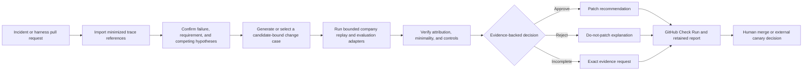

# Causure engineering case study

> Functional evidence-gated agent change control. Change only what the evidence supports.

## The problem

Agent failures often produce an attractive first diagnosis: rewrite the prompt, add another
reviewer, change routing, or patch a tool description. That diagnosis can be wrong even when
the proposed patch improves the visible example. A broad change can mask an environmental
failure, target the wrong harness component, break negative controls, or add cost and latency
without addressing the cause.

Causure treats the proposed change as a claim to be proved. It asks whether the failure
reproduces, whether an isolated intervention identifies the causal component, whether a
smaller change exists, and whether positive, negative, regression, cost, and latency controls
support the candidate. The output can approve a patch, reject it, request evidence, require
human review, or allow a narrowly qualified conditional pass.

## The user journey



The candidate repository remains data while trusted adapters come from a protected base.
Causure publishes evidence and recommendations; it does not merge, deploy, or roll back a
change by itself.

## What was built

- `causure demo` produces one supported narrow patch and one plausible wrong patch, entirely
  offline, with human-readable reports and canonical machine results.
- `causure init`, `causure doctor`, `causure investigate`, and `causure case create` provide
  a no-manual-JSON path from project setup through minimized trace selection and a bounded
  evidence case.
- A deterministic review engine checks reproduction, causal attribution, no-change evidence,
  minimality, positive/negative/regression controls, cost, and latency.
- A protected GitHub workflow discovers the changed harness component, generates or selects
  its exact case, re-verifies the publication subject, publishes one stable Check Run, and
  retains the evidence chain.
- TFVC integration, signed approvals, audit chains, tenant policy, a transactional Team
  service, Windows packaging, and an OpenAI-compatible quota pilot demonstrate deeper
  enterprise boundaries without making them the public onboarding path.

## Design decisions

1. **Gate evidence before generating another patch.** The product controls whether a proposed
   harness change is justified instead of becoming another autonomous patch generator.
2. **Keep one canonical project configuration.** GitHub selection and trusted adapters extend
   `.causure/config.json`; users do not maintain a second workflow-specific configuration.
3. **Execute trusted generators only from the protected base.** Candidate content never
   supplies executable adapter code, and generator-backed forks fail before adapter execution.
4. **Bind every hosted result to exact bytes and identities.** Repository IDs, base/head SHAs,
   run attempt, workflow SHA, case/result/report digests, and changed component are verified
   before publication.
5. **Make abstention a product outcome.** Missing or contradictory evidence remains visible as
   `needs_evidence`, `reject`, or `human_review`; it is not coerced into success.

The detailed rationale is retained in the
[architecture decisions](decisions/0001-evidence-gate-first.md), including the
[canonical configuration decision](decisions/0028-reuse-the-canonical-project-config-for-github-selection.md)
and [protected generator decision](decisions/0029-run-case-generators-only-from-a-protected-base.md).

## Measured engineering evidence

- The final release validation passed 556 tests with one expected platform-specific skip,
  plus Ruff lint and formatting checks.
- The public-snapshot checker accepted the final tracked tree with no blocker or warning.
- The `0.4.0a18` wheel installed offline and completed the demo in clean Python 3.11, 3.12,
  and 3.13 environments. Independent builds produced the same wheel byte-for-byte, and the
  normalized source archive rebuilt that exact wheel.
- An unfamiliar terminal-capable participant used a candidate wheel from the qualified
  source revision to finish the synthetic demo in under five minutes with zero assistance,
  opened a generated Markdown report, and correctly distinguished the causally supported
  narrow patch from the wrong-component, overbroad change that failed a negative control.
- Final-repository pull requests exercised successful approval, fail-closed rejection,
  needs-evidence escalation, required package and OS/Python checks, CodeQL, dependency
  review, and a credential-free fork that stopped before protected execution or publication.
- An anonymous post-release audit cloned the one-root history and verified all seven
  downloaded release assets by SHA-256. The final audit recorded zero open Dependabot,
  CodeQL, or secret-scanning alerts.

The [public-release qualification](qualifications/causure-public-release-2026-08-13.json)
records the exact repository identity, hosted runs, artifact hashes, security state, and
limitations.

## Security and privacy boundary

- The guided importer previews redaction and stores candidate-only references rather than raw
  message bodies or source paths.
- Pull-request workflows accept the unprivileged `pull_request` event, use least-privilege
  permissions, pin third-party Actions to full commits, and do not expose secrets to forks.
- Trusted replay, evaluator, and generator adapters are privileged company code. Process and
  container budgets reduce impact but are not a complete hostile-code sandbox.
- Evidence files cannot choose arbitrary commands, worker images, credentials, tenant roles,
  or merge/deployment actions.
- Reports explain what was observed, user-confirmed, inferred, missing, or contradicted; a
  self-reported confidence score does not prove causality.

## Explicit production limits

Causure is a functional alpha, not a supported multi-tenant production control plane. The
current shared-service reference uses single-host SQLite and local storage; shared relational
authority, immutable object retention, independent ledger anchoring, disaster recovery,
multi-host coordination, generalized SSO, production TLS/secret management, and an
independent security review remain P2 work. Company replay/evaluator quality and deployment
policy remain trusted inputs.

The [P0-A human usability criterion](qualifications/p0a-unfamiliar-user-2026-08-11.json) is
complete for one participant and one Windows environment. Public approve, reject/abstain,
needs-evidence, and credential-free fork examples are qualified against the final clean
repository identity; each company must still qualify its own adapters, evidence quality,
policies, and deployment environment.

## Try the bounded product path

```powershell
causure demo
causure init my-agent-project
causure doctor --project my-agent-project
```

For real evidence, continue with `causure investigate` and `causure case create`. The public
claim is intentionally narrow: **functional evidence-gated agent change control**, not
production-ready autonomous self-improvement.
